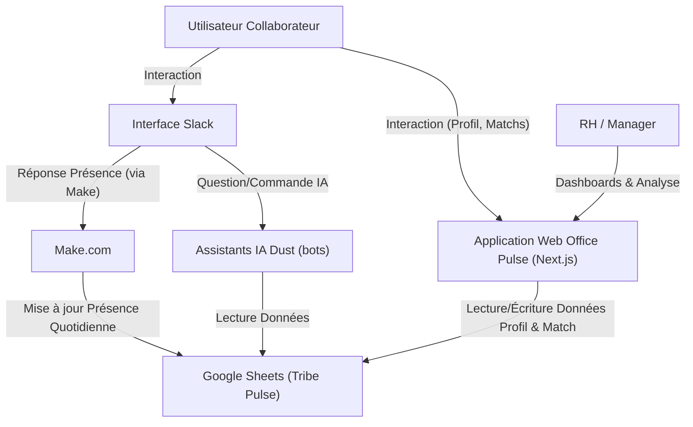

# Office Pulse - Welcome to the Jungle (Projet de Démonstration)

Bienvenue sur le projet Office Pulse, une application conçue pour faciliter la connexion et l'interaction entre collègues au sein d'une entreprise. Ce README fournit les informations nécessaires pour comprendre, installer et contribuer au projet.

## Dépôt Git et Guide d'Installation

### Accès au Code Source

Le code source complet de ce projet est hébergé sur un dépôt Git. npm run dev

*   **URL du Dépôt Git** : `[VEUILLEZ INSÉRER L'URL DE VOTRE DÉPÔT GIT ICI]`

### Prérequis d'Installation

Avant de commencer, assurez-vous d'avoir les outils suivants installés sur votre système :

*   **Node.js** : Version 18.x ou supérieure recommandée. Vous pouvez le télécharger depuis [nodejs.org](https://nodejs.org/).
*   **npm** (Node Package Manager) ou **yarn** : Généralement inclus avec Node.js.

### Étapes d'Installation

1.  **Clonez le dépôt Git** (si vous ne l'avez pas déjà fait) :
    ```bash
    git clone [URL_DE_VOTRE_DÉPÔT_GIT]
    cd [NOM_DU_DOSSIER_DU_PROJET] # Souvent 'velc' ou similaire
    ```

2.  **Installez les dépendances du projet** :
    Ouvrez un terminal à la racine du projet cloné et exécutez :
    ```bash
    npm install
    ```
    ou si vous utilisez yarn :
    ```bash
    yarn install
    ```

3.  **Configuration de l'environnement** :
    *   **Clé de Compte de Service Google** : Ce projet interagit avec Google Sheets. Vous aurez besoin d'un fichier de clé de compte de service JSON.
        *   Placez votre fichier de clé (par exemple, `noted-handler-461816-q2-9331c5aed3ee.json`) à la racine de votre projet (par exemple, dans le dossier `velc/`).
        *   Assurez-vous que les chemins vers ce fichier dans les routes API (par exemple, `velc/app/api/save-profile/route.ts` et `velc/app/api/update-user-match/route.ts`) sont corrects. Actuellement, ils utilisent des chemins relatifs comme `path.resolve('../noted-handler-461816-q2-9331c5aed3ee.json')` ou `path.join(process.cwd(), 'votre-fichier-cle.json')`. Le plus sûr est souvent `path.join(process.cwd(), 'nom-de-votre-fichier-cle.json')` si la clé est à la racine du projet.
    *   **Autres Variables d'Environnement** : S'il y a d'autres configurations spécifiques (clés d'API, etc.), elles devraient être listées ici, souvent dans un fichier `.env.local` (qui doit être ajouté à `.gitignore`).

4.  **Lancez le serveur de développement** :
    ```bash
    npm run dev
    ```
    ou avec yarn :
    ```bash
    yarn dev
    ```
    L'application devrait maintenant être accessible à l'adresse `http://localhost:3000` (ou un autre port si configuré différemment).

## Ressources Graphiques et Assets Utilisés

Les ressources graphiques et autres assets statiques (images, icônes, etc.) utilisés dans ce projet sont principalement situés dans le répertoire suivant :

*   **`/public`** : Conformément aux conventions de Next.js, ce dossier contient les assets accessibles publiquement.
    *   Les logos, images de fond, et autres icônes spécifiques au projet s'y trouvent.
*   **Avatars Générés** : Certaines fonctionnalités peuvent utiliser des services comme [DiceBear Avatars](https://www.dicebear.com/) pour générer des avatars dynamiquement (comme vu dans `profile-creation-form.tsx`).
*   **Images de Placeholder** : Des placeholders d'images (par exemple, de [Unsplash](https://unsplash.com/)) peuvent être utilisés dans les composants de démonstration comme `match-carousel.tsx`.

Si des assets spécifiques nécessitent une attribution ou proviennent de sources particulières, cela devrait être détaillé ici ou dans un fichier `ATTRIBUTIONS.md` séparé.

## Documentation des Dépendances et Prérequis Techniques

### Prérequis Techniques (Rappel)

*   **Node.js** (v18+)
*   **npm** ou **yarn**
*   Navigateur web moderne (Chrome, Firefox, Edge, Safari)

### Dépendances Principales du Projet

Le projet est construit avec Next.js et s'appuie sur plusieurs bibliothèques et frameworks clés :

*   **Next.js** (`next`) : Framework React pour la production (SSR, SSG, routage, etc.).
*   **React** (`react`, `react-dom`) : Bibliothèque JavaScript pour la construction d'interfaces utilisateur.
*   **Tailwind CSS** (`tailwindcss`) : Framework CSS utility-first pour un style rapide et personnalisable. Utilisé via `@tailwindcss/forms` et d'autres plugins si configurés.
*   **Shadcn/UI** (implicite par l'utilisation de `@/components/ui/*`) : Collection de composants d'interface utilisateur réutilisables, construits avec Radix UI et Tailwind CSS.
*   **Google APIs** (`googleapis`, `google-auth-library`) : Pour l'intégration avec Google Sheets afin de sauvegarder et mettre à jour les données des profils et des matchs.
*   **Lucide React** (`lucide-react`) : Bibliothèque d'icônes SVG légères et personnalisables.
*   **Framer Motion** (`framer-motion`) : Bibliothèque pour les animations complexes et fluides en React.
*   **Canvas Confetti** (`canvas-confetti`) : Pour les effets de confettis (par exemple, lors d'un match).
*   **TypeScript** : Utilisé pour le typage statique et l'amélioration de la maintenabilité du code.
*   **ESLint / Prettier** : Pour le linting et le formatage du code (configuration typique dans les projets Next.js modernes).

La liste complète des dépendances et de leurs versions exactes se trouve dans le fichier `package.json` à la racine du projet.

### Configuration Spécifique

*   **Intégration Google Sheets** : Nécessite une configuration correcte du compte de service Google Cloud et le partage de la feuille de calcul cible avec l'email du compte de service.
*   **API Routes Next.js** : Les interactions backend (comme la sauvegarde de profil, la mise à jour des matchs) sont gérées via les API routes dans le dossier `app/api/`.

---

Ce README a pour but de fournir un point de départ. N'hésitez pas à le compléter avec des informations plus spécifiques à mesure que le projet évolue.

# Documentation Technique – Projet Tribe (Welcome to the Jungle) - Hackathon

✨ **Introduction**

Ce document présente l'architecture fonctionnelle et technique de l'écosystème Tribe, une plateforme hybride combinant une application web interne (Office Pulse, décrite ci-dessus) et une suite d'assistants IA intégrés à Slack. L'objectif est de fluidifier la gestion des présences, d'encourager les connexions humaines et de donner aux RH, managers et plus tard à l'office manager, des outils d'analyse et d'action adaptés.

⚙️ **Cartographie fonctionnelle**

🔶 **Application Tribe (Interface Web - Office Pulse)**

*   **Accès collaborateur :**
    *   Formulaire de création de profil : email, nom complet, poste
    *   Déclaration des jours de présence habituels, préférences d'ambiance, passions
    *   Choix des groupes et centres d'intérêt souhaités pour se connecter avec les autres
    *   Stockage des données : toutes les réponses sont centralisées dans Google Sheets (Tribe Pulse)
*   **Fonctionnalités RH / Manager (et bientôt Office Manager) :**
    *   Dashboards de visualisation personnalisés (ex. : répartition des présences, matching projets/interactions, suivi culturel)
    *   Accès aux données enrichies pour l'analyse d'équipe, la proposition de formations ou d'évolutions

🟡 **Slack (Interface conversationnelle)**

*   Interactions dans Slack (répondre aux collaborateurs, créer du lien, informer RH/managers)
*   **Assistants IA Dust connectés à Slack :**
    *   `Tribe-bot` : répond aux questions culturelles, propose des moments de cohésion, recommande des jours de présence
    *   `Tribe-groups-bot` : crée des groupes Slack selon les centres d'intérêt, ajoute automatiquement les membres selon la base
    *   `Tribe-presence-bot` : suit les présences via la GSheet mise à jour par Make, répond aux questions "Qui vient demain ?"
*   **Automatisations via Make :**
    *   Envoi quotidien à 18h d'un message Slack demandant la présence du lendemain
    *   Mise à jour automatique de la colonne "Presence Tomorrow" dans Tribe Pulse

🧩 **Guide d'installation et de configuration (Écosystème Slack/IA)**

*   **Prérequis**
    *   Un espace Slack (accès admin)
    *   Un compte Dust (https://dust.tt)
    *   Un compte Make (anciennement Integromat)
    *   Une Google Sheet structurée (nommée "Tribe Pulse" dans ce contexte)
*   **Étapes principales**
    1.  Créer les 3 assistants sur Dust avec leurs prompts respectifs.
    2.  Connecter chaque agent à Slack (via "Channels" dans Dust).
    3.  Ajouter la Google Sheet "Tribe Pulse" comme source de données dans Dust.
    4.  Automatiser la collecte des présences via Make (créer un scénario pour envoyer un message Slack et pusher les réponses dans la Google Sheet chaque soir).

🔌 **Documentation des API / Intégrations (Écosystème Slack/IA)**

*   **Make**
    *   Slack → Make → Google Sheets
    *   Message automatique envoyé à 18h à chaque employé.
    *   Réponses centralisées dans la colonne "Presence Tomorrow" de la Google Sheet.
*   **Dust → Google Sheets**
    *   Lecture seule de la base "Tribe Pulse" : Nom, Poste, Slack ID/Email, Présence, Groupes, Affinités, Projets, Centres d'intérêt, etc.
*   **Slack (via Dust)**
    *   Les agents peuvent être sollicités dans tous les canaux où ils sont invités.
    *   Capables d'agir en DM ou en public (selon le type de requête et la configuration de l'agent).

🏛️ **Architecture technique (Schéma simplifié de l'écosystème)**



*Légende : Les flèches indiquent le flux principal d'interaction ou de données.*

🔄 **Maintenance & évolutions (Écosystème Slack/IA)**

*   Vérification hebdomadaire de la cohérence des colonnes de la Google Sheet "Tribe Pulse".
*   Mise à jour des prompts des assistants Dust si les besoins ou les sources de données évoluent.
*   Ajout des nouveaux collaborateurs : Processus à définir (via le formulaire de l'application Office Pulse, ajout manuel à la GSheet, synchronisation depuis un SIRH via Make, etc.).
*   Ajout futur de dashboards pour l'office manager dans l'application Office Pulse.
